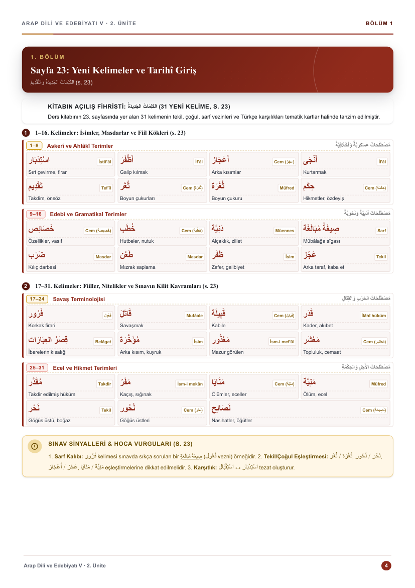
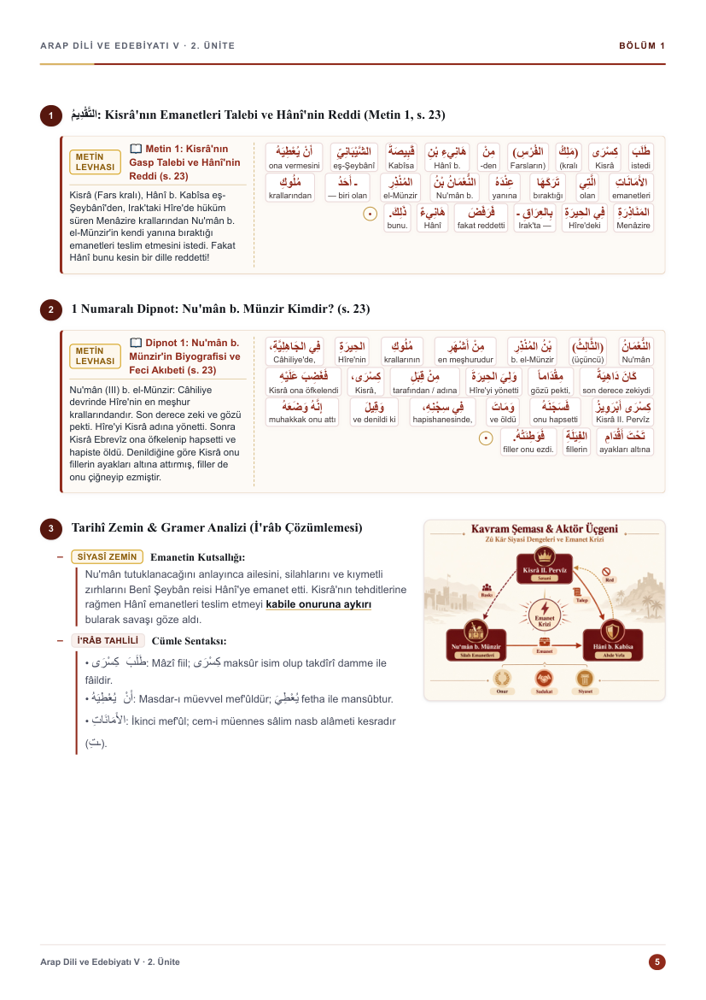

# Görsel Ders Notu Üretim Sistemi

[](https://github.com/ByNuman/ders-uretim-sistemi/actions/workflows/build.yml) [](LICENSE) [](https://www.python.org/) [](https://playwright.dev/) [](#ne-üretir)

Üniversite derslerinin ve İslâmî ilimler müfredatının ham metin özetlerini **A4 görsel ders notu kitabı** PDF'ine çeviren yüksek standartlı bir üretim hattı. 

Çıktı; altın köşe motifli vektörel kapak, kapak arkası boş sayfa (çift taraflı baskı / Senaryo A uyumu), tek sayfalık dinamik içindekiler, 4:3 oranında pedagojik şema ve görsel kutulu bölümler (`add_block_gorsel`), İslâmî ilimler / Arapça nass ve satır altı (interlinear) tercüme levhaları, 4'lü tematik kelime kartları ve 20 soruluk pedagojik zorluk piramidine sahip çoktan seçmeli test (10+10 ferah düzen) + analitik çözümlü cevap anahtarından oluşur.

PDF doğrudan **fotokopi ve ofis yazıcısıyla çoğaltılmak** üzere hazırlanır: dar kenarlı A4 (210 × 297 mm), RGB, taşma payı yok. Matbaaya iş göndereceğiniz gün `--cmyk` bayrağı aynı dosyayı **PDF/X-4 (DeviceCMYK)** standardına çevirir ve kesim kutularını yazar.

Ders içeriği HTML/CSS'te değil, **Python veri modelinde** tanımlanır (`cekirdek/content_model.py`). Tasarım tek bir yerde durur (`templates/`), içerik ise her ders için ayrı bir modülde (`src/`). Bu sayede tasarımda yapılan bir iyileştirme tüm derslere ve haftalara anında uygulanır.

---

<p align="center">
  
  
  
  
</p>

<p align="center">
  <sub><b>Sistemin güncel çıktılarından:</b> Vektörel Kurumsal Kapak · Pedagojik Görsel Kutulu Bölüm (4:3 Float Mizanpaj) · Tematik Arapça Kelime Kartları · 10+10 Ferah Değerlendirme Testi</sub>
</p>

<p align="center">
  
  
</p>

<p align="center">
  <sub><b>Derinlikli Dil ve Sınav Mimarisi:</b> Kelime Kelime Satır Altı (Interlinear) Tercüme Levhası ve Kavram Şeması · Arapça Mealli Analitik Çözümlü Cevap Anahtarı</sub>
</p>

---

## Öne Çıkan Pedagojik ve Tipografik Standartlar

### 1. 🖼️ Pedagojik Görsel & Şema Matrisi (`add_block_gorsel`)
- **Float Metin Sarmalama Mimarisi:** Görsel kutusu rijit grid yerine sağa yaslanır (`float: right`). Metin başlığı ve ilk maddeler görselin solunda akarken, devam eden maddeler görselin altına taşarak tam genişliğe yayılır; sayfada ölü boşluk kalmaz.
- **4:3 En-Boy Oranı:** Tüm şema ve infografik çerçeveleri uluslararası 4:3 standardında yerleştirilir.
- **11 Temel Pedagojik Şablon:** İnfografik Harita (havzalar), Kronolojik Zaman Çizelgesi, İsnad/Sened Ağacı, Hüküm Karar Ağacı, Hiyerarşik Değerler Piramidi, Çoklu Mezhep/Ekol Matrisi, İki Kutuplu Karşılaştırma Şeması, Silsile & İlim Ağacı, Kavram & Nitelik Şeması, Döngüsel Süreç Modeli, Yapısal Kesit & Eser Mimarisi.
- **Sıfır Mikro-Metin Kuralı:** Görsel kutuları kompakt olduğundan, içine okunaksız küçük paragraflar konulmaz; iri, net ve ferah 1–3 kelimelik Türkçe kavram etiketleri ve akış okları kullanılır.

### 2. 📖 İslâmî İlimler, Nass ve Arapça BiDi Tipografisi
- **BiDi İzolasyonu & Font Ölçeği:** LTR Türkçe metin içerisinde Arapça karakterlerin noktalama işaretlerini ve liste imlerini bozmasını önlemek için tüm Arapça ibareler `<bdi class="ar">` ile izole edilir. Arapça ve harekeli ibareler net okunabilirlik için %130 daha büyük (`font-size: 1.28em–1.32em`) ve ferah satır aralığıyla (`line-height: 1.68`) işlenir.
- **Arap Dili Bütünleşik Modeli:** 
  - Kitap başındaki kelimeler 4 sütunlu estetik kelime kartları (`.vocab-grid-4`, `.v-card`) halinde tanzim edilir (Arapça kelime, sarf/vezin/cem rozeti, Türkçe karşılık).
  - Klasik metinler, hutbeler ve alıştırmalar `_w(ar, tr)` belirteçleriyle kelime kelime satır altı (interlinear) tercüme edilir.
  - Ana metinler `_board` (çift sütunlu levha), alıştırmalar `_box` (satır altı kutusu) ile sunulur.

### 3. 🎯 20 Soruluk Pedagojik Zorluk Piramidi & Çözümlü Cevap Anahtarı
- **Pedagojik Piramit (10 + 10 Soru):** 
  - *1–6. Sorular (Kolay):* Doğrudan kavram, terim ve isim bilgisi.
  - *7–14. Sorular (Orta):* Karşılaştırma, usûl tahlili ve sebep-sonuç ilişkileri.
  - *15–20. Sorular (Zor):* Öncüllü sorular (Roman rakamlı `I, II, III`), olumsuz soru kökleri ve Arapça ibare çözümlemeleri.
- **Şık Boyutu Eşitliği & Homojenlik:** "En uzun şık doğru cevaptır" yanılsaması kesinlikle engellenir; 5 seçenek (`A, B, C, D, E`) paralel cümle yapısında ve birbirine denk uzunlukta tanzim edilir.
- **Parantez İçi Tüyo Yasağı:** Soru kökünde veya şıklarda terimin Türkçe anlamını parantez içinde vermek yasaktır; anlam ve izahlar çözümlü cevap anahtarında öğretici olarak sunulur.
- **Ferah Test Düzeni:** Test tam 2 sayfaya yayılır. Sorular arasında göz yoran kesik çizgiler yerine temiz dikey beyaz boşluk (`margin-bottom: 1.0–2.0mm`) kullanılır.
- **Analitik Çözümlü Cevap Anahtarı:** Tam 1 sayfaya dengeli yayılır (%85–95 doluluk). Minik punto yerine gövde standardına yakın punto (`9.2pt`), belirgin doğru cevap hap rozetleri (`8.2pt`) ve Arapça ibarelerin Türkçe mealleri eksiksiz verilir.

### 4. 📐 Senaryo A Mizanpajı & Çift Taraflı Baskı Uyumu
- **Kapak Arkası Boş Sayfa:** Çift taraflı baskıda içindekiler sayfasının daima sağ sayfada açılabilmesi için kapağın hemen arkasına boş sayfa (`<section class="page blank-page ...">`) yerleştirilir.
- **Tekil Ders Notu Akışı:** `s.1 Kapak` → `s.2 Boş Sayfa` → `s.3 İçindekiler` → `s.4 Bölüm 1`.
- **Tek Sayfalık İçindekiler:** İçindekiler asla 2. sayfaya taşmaz (`TOC_MAX_ROWS = 14`); sığdırmayı CSS sıkışık kipi dinamik olarak yönetir.

### 5. ⚡ 0 mm Taşma & Sayfa Verimliliği
- Sayfalarda gereksiz boşluk ve seyreklik yasaktır; her sayfa `%90–100` doluluk hedefler.
- `tools/olcum.py` ile sayfa doluluğu milimetrik ölçülür; `build.py` taşma denetiminde **0 mm taşma** ("tüm sayfalar 210x297mm sınırları içinde ✓") görülmeden derleme tamamlanmış sayılmaz. Taşan sayfalar `tools/dengele.py` ile otomatik dengelenir.

---

## Hızlı Başlangıç

Sistemi bilgisayarınıza kurmak ~10-15 dakika sürer (büyük bölümü Chromium indirmesidir):

```bash
git clone https://github.com/ByNuman/ders-uretim-sistemi.git
cd ders-uretim-sistemi

pip install -r requirements.txt      # Python paketleri (jinja2, pypdf, pymupdf vb.)
npm install                          # Playwright altyapısı
npx playwright install chromium      # PDF render motoru (~150 MB, tek seferlik)

python build.py ornek_ders           # Örnek dersi derle
```

Son komut 13 sayfalık örnek bir ders PDF'i üretir. Ürettiyse kurulum tamamdır.

**İşletim sistemine göre adım adım anlatım ve sorun giderme için: [`docs/KURULUM.md`](docs/KURULUM.md)**

---

## Ne Üretir

| Çıktı | Komut |
|---|---|
| Tek dersin / haftanın görsel ders notu PDF'i | `python build.py <slug> --sinif X --donem Y --sinav Z` |
| Bir dönemin veya haftanın birleşik kitabı | `python build_kitap.py --sinif X --donem Y --sinav Z` |
| Bir sınıfın tüm ders kapaklarının renk önizlemesi | `python tools/kapak_onizleme.py --sinif 3` |
| Sayfa doluluk ve verimlilik ölçümü | `python tools/olcum.py <slug> --sinif X --donem Y --sinav Z` |
| Otomatik sayfa taşma dengelemesi | `python tools/dengele.py <slug> --sinif X --donem Y --sinav Z` |

Sayfa özellikleri: **A4 (210 × 297 mm)**, dar kenar boşlukları (üst 12 · alt 15 · yan 12 mm), taşma payı yok ve gerçek PDF yer imleri. Çıktı varsayılan olarak **RGB**'dir. Matbaa için `--cmyk` bayrağı **PDF/X-4 (DeviceCMYK)** dönüşümünü açar.

---

## Depoda Ders PDF'leri Neden Yok?

Bu depo **sistemin kendisini** içerir, telifli ders çıktılarını değil. İki gerekçeyle:

1. **Çıktılar Yeniden Üretilebilir:** Bir dersin asıl kaynağı `src/<ders>.py` modülüdür; PDF her zaman saniyeler içinde yeniden derlenebilir. İkili (binary) PDF dosyalarını depoda tutmak Git geçmişini gereksiz şişirir.
2. **Ham Kaynaklar Kişiseldir:** `kaynaklar/` altındaki materyaller telifli kitaplar veya el notları olabilir; açık depoda yayınlanmaz.

Bu sebeple `gorsel_ders_notlari/`, `calisma_rehberleri/`, `ders_anlatimlari/` ve `kaynaklar/` altındaki dosyalar `.gitignore` ile korunur; depoda yalnızca klasör iskeletleri (`.gitkeep`) durur.

---

## Klasör Mimarisi

Sistem hem basit tekil çalışmalar için düz `dersler/` yapısını hem de üniversite dönemlerini yöneten sınıf ağacını destekler:

```
3-sinif/1-donem/vize/
├── kaynaklar/
│   ├── ders_kaynaklari/<DERS ADI>/     # GİRDİ: Ham ders metni / kaynak PDF
│   ├── ogretmen_notlari/<DERS ADI>/    # GİRDİ: Ders takip ve dikte notları
│   └── özetlenmiş_dersler/<DERS ADI>/  # GİRDİ: Ham metinden çıkarılan yazılı özet
├── src/                                # <ders>_hafta_<N>.py Python içerik modülleri
├── gorsel_ders_notlari/<DERS ADI>/     # ÇIKTI: 0 mm taşmalı nihai PDF + HTML
├── calisma_rehberleri/<DERS ADI>/      # ÇIKTI: Pratik çalışma rehberleri
└── ders_anlatimlari/<DERS ADI>/        # ÇIKTI: Detaylı akademik ders anlatımları
```

Paylaşılan altyapı kök dizindedir:
- `build.py` — Tekil ders ve hafta derleyicisi
- `build_kitap.py` — Dönem ve haftalık birleşik kitap oluşturucu
- `cekirdek/content_model.py` — Tip güvenli Python içerik veri modeli
- `cekirdek/theme_engine.py` — Otomatik CSS ton ve palet türetici
- `cekirdek/renk_uretici.py` — Resmî ders rengi belirleyici
- `cekirdek/pdfx.py` — Ghostscript PDF/X-4 CMYK prepress motoru
- `templates/` — Jinja2 HTML şablonları ve `style.css`
- `tools/` — `olcum.py`, `dengele.py`, `kapak_onizleme.py`, `kalibre.py`

---

## Renk = Dersin Ruhu

Her dersin vurgu rengi tek bir hex kodundan türetilir; `cekirdek/theme_engine.py` kapak gradyanından tablo başlığına ve rozet tonlarına kadar tüm renkleri otomatik üretir. Ders renkleri `cekirdek/renk_uretici.py` içindeki `DERS_RENKLERI` tablosunda **önceden belirlenmiştir**:

| Ders | Renk | Anlam ve Gerekçe |
|---|---|---|
| **Tefsir** | `#206040` | Mushaf yeşili — vahyin metni |
| **Kur'an Okuma ve Tecvid** | `#1D6363` | Turkuaz — tilavetin akışı |
| **Hadis** | `#664324` | Koyu deri cilt — rivayet, isnad, el yazması |
| **Sistematik Kelâm** | `#592F79` | Erguvan moru — soyut akıl, akide |
| **İslâm Felsefesi Tarihi** | `#2F2D76` | Gece mavisi — serin akıl, hikmet |
| **İslâm Hukuku** | `#7A2433` | Vişne — mühür, hüküm, otorite |
| **Tasavvuf** | `#7B3260` | Gül kurusu — aşk, sema, kalp |
| **İslâm Medeniyeti / Mezhepleri** | `#776931` | Bronz — altın çağ, kadim tarih |
| **Arap Dili ve Edebiyatı** | `#8C2F21` | Terracotta — çöl toprağı, hat sanatı |
| **Eğitim Bilimleri / Sınıf Yönetimi** | `#1F4775` | Çini laciverti — düzen, pedagoji |
| **Din Eğitimi / Rehberlik** | `#51662E` | Zeytin yeşili — fide, yetiştirme |

```bash
python cekirdek/renk_uretici.py --tablo               # Belirlenmiş renk tablosu
python cekirdek/theme_engine.py                       # Hazır palet önizlemesi
python tools/kapak_onizleme.py --sinif 3              # Kapakları tek PDF'te incele
```

---

## Lisans ve Kullanım Şartları

Bu depoda iki ayrı içerik türü bulunur ve **bağımsız olarak** lisanslanmıştır:

| Bileşen | Lisans | Açıklama |
|---|---|---|
| **Sistem & Araçlar** (`build.py`, `templates/`, `cekirdek/`, `tools/`) | **GNU GPL v3** ([`LICENSE`](LICENSE)) | Özgür yazılımdır; değiştirebilir ve dağıtabilirsiniz. |
| **Ders İçerikleri** (`<dönem>/src/*.py` içindeki ders metinleri) | **Tüm Hakları Saklıdır** | Üniversite ders kitaplarından türetilmiş kişisel özetlerdir; ticari veya serbest dağıtıma açık değildir. |

Copyright (C) 2026 Numan Gözdaş

Ayrıntılı telif ve üçüncü taraf bileşen bilgileri için: **[`docs/TELIF.md`](docs/TELIF.md)**
