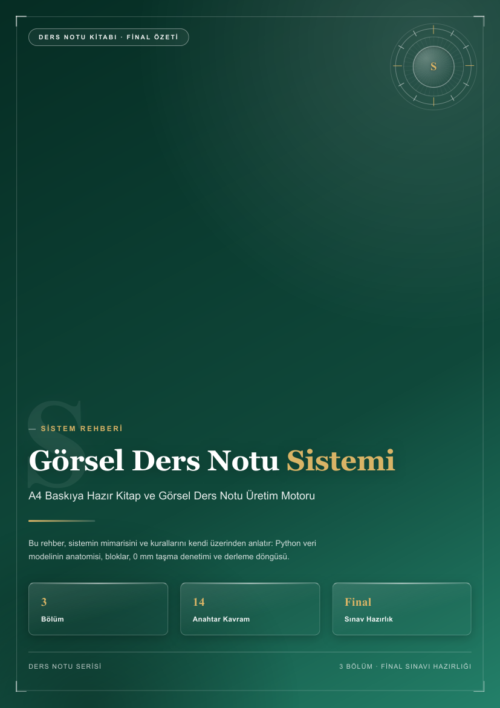
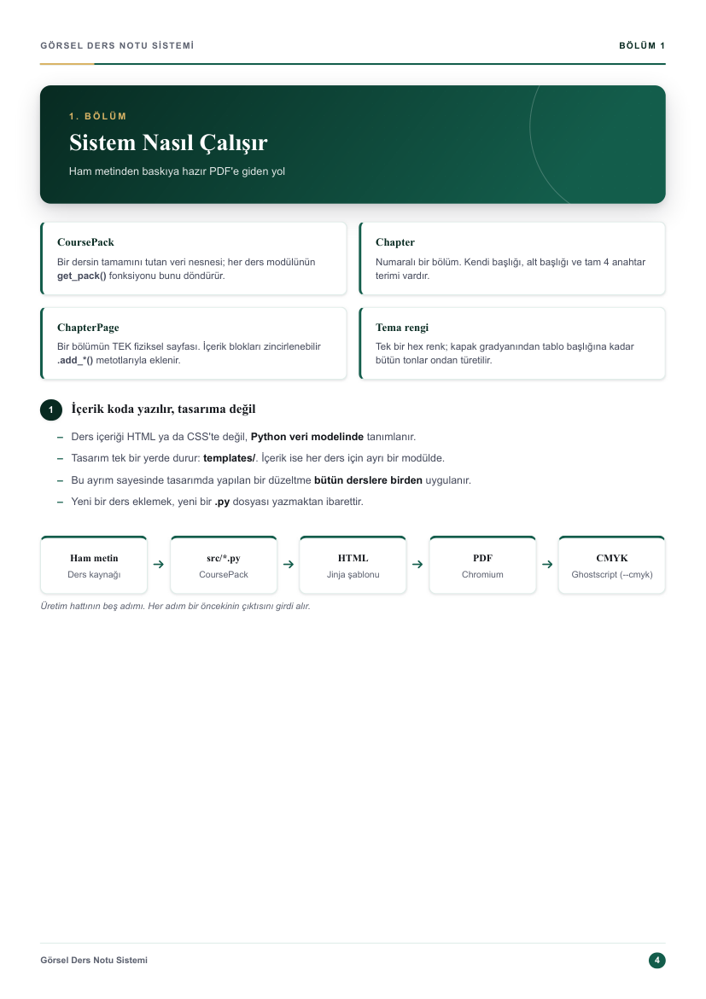
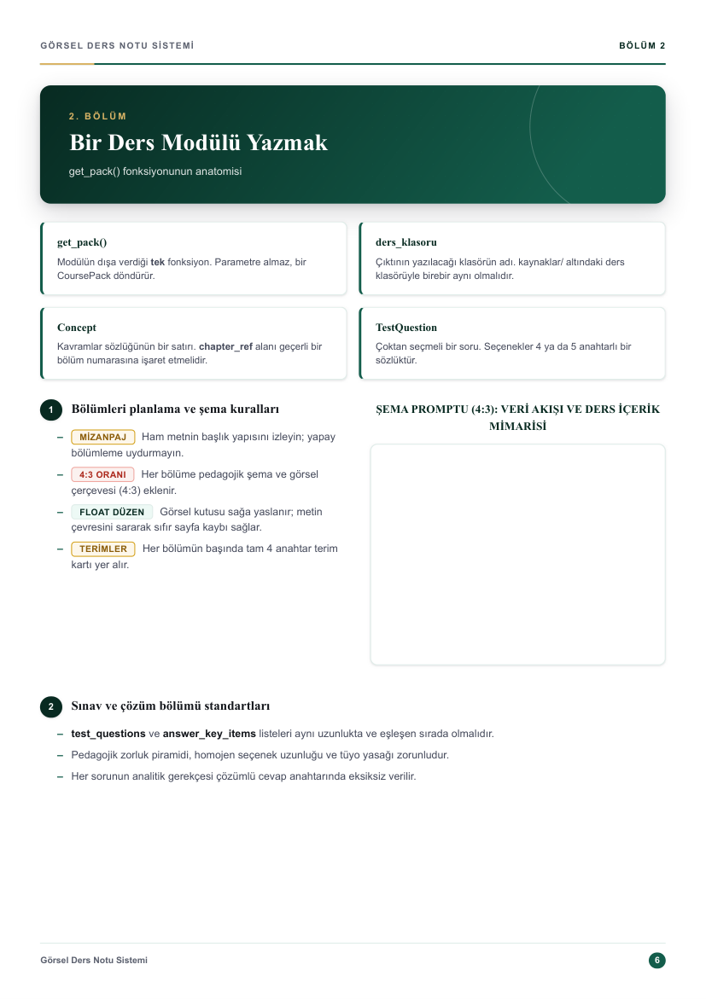
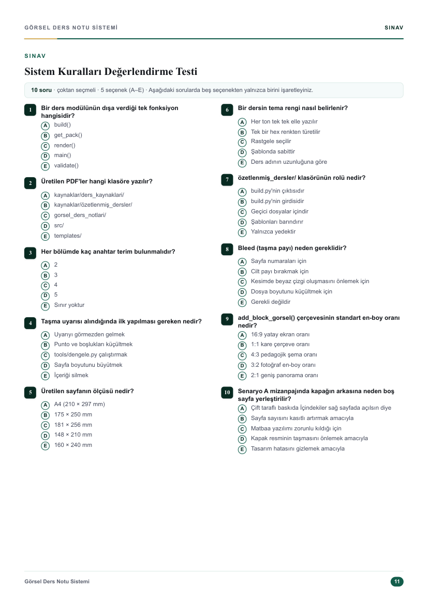
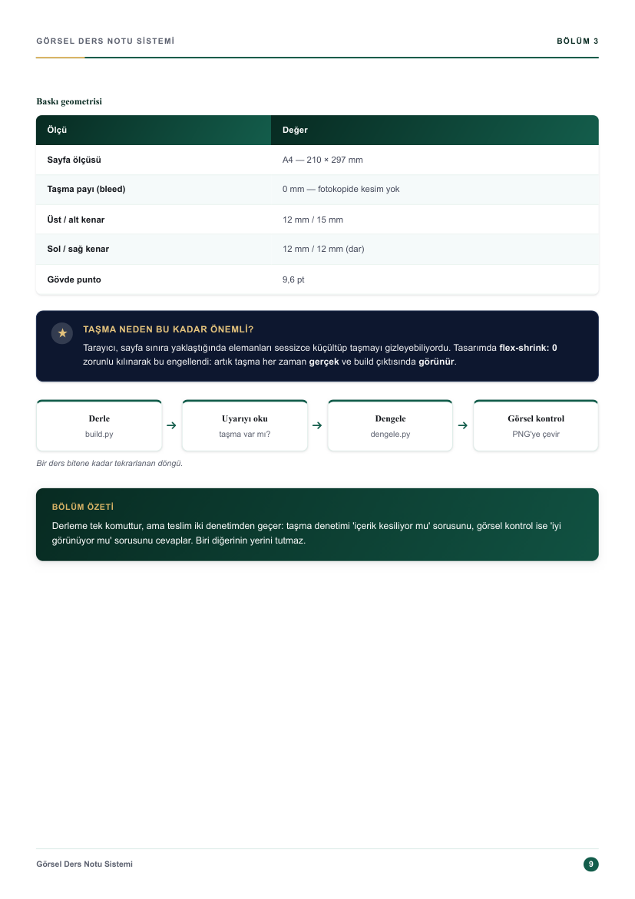
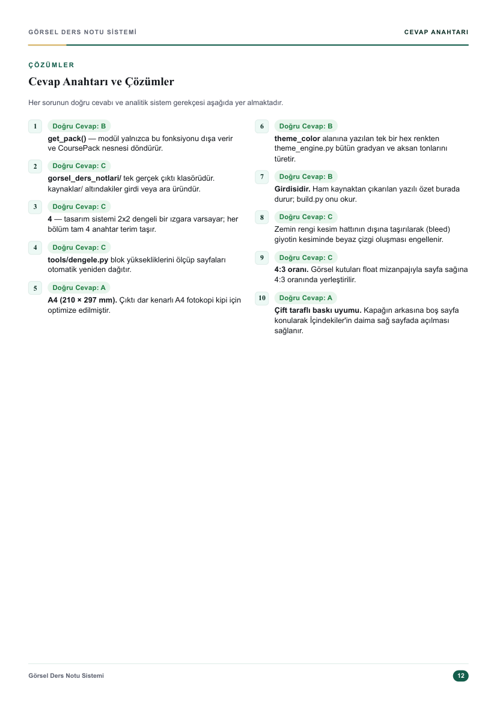

# Görsel Ders Notu Üretim Sistemi (Typesetting Engine)

[](https://github.com/ByNuman/ders-uretim-sistemi/actions/workflows/build.yml) [](LICENSE) [](https://www.python.org/) [](https://playwright.dev/) [](#nasıl-kullanılır)

Yapılandırılmış eğitim içeriklerini ve ders özetlerini doğrudan **baskıya hazır A4 görsel ders notu kitabı** PDF'ine dönüştüren programatik bir yayın ve dizgi motorudur.

Çıktı; kurumsal vektörel kapak, çift taraflı baskı uyumlu sayfa düzeni (Senaryo A), tek sayfalık dinamik içindekiler, 4:3 oranında pedagojik şema ve görsel kutulu bölümler (`add_block_gorsel`), karşılaştırma tabloları, akış şemaları, kavramlar sözlüğü, pedagojik zorluk piramidine sahip değerlendirme testi ve analitik çözümlü cevap anahtarından oluşur.

PDF doğrudan **fotokopi ve ofis yazıcısıyla çoğaltılmak** üzere hazırlanır: dar kenarlı A4 (210 × 297 mm), RGB, taşma payı yok. Matbaaya iş gönderileceği gün `--cmyk` parametresi aynı dosyayı **PDF/X-4 (DeviceCMYK)** standardına çevirir ve kesim kutularını (CropBox/BleedBox/TrimBox) yazar.

---

<p align="center">
  
  
  
  
</p>

<p align="center">
  <sub><b>Sistemin Kendi Çıktılarından Ürün Vitrini:</b> Vektörel Sistem Kapağı · Sistem Mimarisi & Veri Akışı · 4:3 Pedagojik Şema ve Mizanpaj Kuralları · Değerlendirme Testi</sub>
</p>

<p align="center">
  
  
</p>

<p align="center">
  <sub>Baskı Geometrisi & Taşma Denetimi Döngüsü · Analitik Çözümlü Cevap Anahtarı</sub>
</p>

---

## Sistem Nasıl Çalışır?

Sistem, **içerik ile tasarımı kesin hatlarla birbirinden ayırır**. İçerik HTML veya CSS ile yazılmaz; Python veri modellerinde tanımlanır. Tasarım tek bir merkezde (`templates/`) durur; içerik ise bağımsız modüllerde (`src/`). Bu sayede şablonda yapılan tek bir geliştirme tüm kitaplara anında yansır.

```
Ham Metin / Özet ──► Python Veri Modeli ──► Jinja2 HTML ──► Playwright Chromium ──► Prepress / PDF
 (Girdi Kaynak)       (CoursePack Nesnesi)   (templates/)     (A4 Piksel Render)     (RGB / PDF/X-4)
```

1. **Python Veri Modeli (`cekirdek/content_model.py`):** Modülün `get_pack()` fonksiyonu; bölümleri (`Chapter`), sayfaları (`ChapterPage`), blokları (`BulletBlock`), tabloları (`ComparisonTable`) ve test sorularını (`TestQuestion`) nesne olarak tanımlar.
2. **Tema Motoru (`cekirdek/theme_engine.py`):** Modüle atanan tek bir ana hex renkten (`theme_color`) kapak gradyanları, tablo başlıkları, rozetler ve çizgi tonları matematiksel olarak otomatik türetilir.
3. **Chromium Render (`build.py`):** Jinja2 şablonundan üretilen HTML, Playwright Chromium motoruyla başsız (headless) taranır; sayfa yükseklikleri milimetrik ölçülür.
4. **Taşma Denetimi:** Sayfa sınırını (297 mm) aşan herhangi bir blok olursa derleyici uyarı verir. Taşan sayfalar `tools/dengele.py` ile otomatik dengelenir.
5. **PDF Üretimi ve Prepress (`cekirdek/pdfx.py`):** `pypdf` ve `pymupdf` ile yer imleri eklenir, nesneler optimize edilir. `--cmyk` verilirse Ghostscript ile FOGRA39 CMYK dönüşümü yapılır.

---

## Görsel Not Üretim Kuralları ve Standartları

Bu motorla görsel ders notu üretilirken aşağıdaki 7 temel standart uygulanır:

### 1. Sayfa Verimliliği ve 0 mm Taşma Kuralı
- Sayfalarda gereksiz seyreklik ve sayfa israfı yasaktır; her sayfa **%90–100 doluluk** hedefler.
- İçeriğin sayfaya sığmayıp alt kenardan sessizce kesilmesini önlemek için CSS'te `flex-shrink: 0` ve `overflow: hidden` uygulanır.
- `tools/olcum.py` ile sayfa doluluk oranları denetlenir; `build.py` konsolunda **0 mm taşma** ("tüm sayfalar 210x297mm sınırları içinde ✓") görülmeden derleme tamamlanmış sayılmaz.

### 2. 4:3 Pedagojik Şema ve Float Metin Sarmalama Mimarisi
- Her bölüme en az bir adet uluslararası **4:3 en-boy oranında** şema/infografik çerçevesi eklenir (`add_block_gorsel`).
- Görsel çerçevesi sağa yaslanır (`float: right`). Metin başlığı ve ilk maddeler görselin solunda akarken, devam eden maddeler görselin altına taşarak sayfanın tam genişliğine yayılır. Böylece görselin altında ölü boşluk kalmaz.
- Görsel kutuları kompakt olduğundan, içine küçük ve okunaksız paragraflar konulmaz; iri, net ve ferah kavram kutucukları ve akış okları tercih edilir (Sıfır Mikro-Metin Kuralı).

### 3. Senaryo A Çift Taraflı Baskı Mizanpajı
- Kitap çift taraflı basıldığında İçindekiler sayfasının daima sağ sayfada açılması için kapağın hemen arkasına boş sayfa (`blank-page`) yerleştirilir.
- **Akış Düzeni:** `s.1 Kapak` → `s.2 Boş Sayfa` → `s.3 İçindekiler` → `s.4 Bölüm 1`.
- **Tek Sayfalık İçindekiler:** İçindekiler asla 2. sayfaya taşmaz (`TOC_MAX_ROWS = 14`); satır sayısı arttığında CSS dinamik sıkışık kipi devreye girer.

### 4. Tipografik Hiyerarşi ve BiDi İzolasyonu
- Kuru liste metinleri yerine kategori rozetleri (`.k-badge`: `.gold`, `.alert`, `.subtle`), koyu madde başlıkları (`.k-title`) ve sol kenarlık çizgili açıklama gövdesi (`.k-subitem`) kullanılır.
- Çift yönlü metinlerde (ör. Arapça, İbranice veya özel alfabeli terimler), LTR akışın noktalama işaretlerini ve liste imlerini bozmasını önlemek için ibareler `<bdi>` etiketiyle izole edilir.

### 5. Pedagojik Zorluk Piramidi (Değerlendirme Testi)
- Test tam 2 sayfaya (10 + 10 soru) dengelenir.
- **Piramit Dağılımı:** 1–6. sorular doğrudan kavram ve isim bilgisi (kolay); 7–14. sorular usûl tahlili ve sebep-sonuç ilişkileri (orta); 15–20. sorular öncüllü (`I, II, III`) ve analitik sorular (zor).
- **Homojen Seçenek Dengesi:** "En uzun şık doğru cevaptır" yanılsaması kesinlikle engellenir; tüm şıklar paralel cümle yapısında ve denk uzunlukta yazılır.
- **Parantez İçi Tüyo Yasağı:** Soru kökünde veya şıklarda terimin anlamını parantez içinde vermek yasaktır.
- Sorular arasında göz yoran çizgiler yerine ferah dikey beyaz boşluk (`margin-bottom: 1.0–2.0mm`) kullanılır.

### 6. Analitik Çözümlü Cevap Anahtarı
- Tam 1 sayfaya dengeli yayılır (%85–95 doluluk).
- Minik punto yerine gövde standardına yakın punto (`9.2pt`), belirgin doğru cevap hap rozetleri (`8.2pt`) ve her sorunun mantıksal çözüm gerekçesi yer alır.

### 7. Renk = Dersin Ruhu (Otomatik Palet)
- Her çalışma tek bir ana renk hex'i ile tanımlanır. Renk motoru bu renkten uyumlu açık zemin, koyu başlık, rozet bordürleri ve kapak gradyanlarını otomatik üretir.

---

## Hızlı Başlangıç & Kurulum

Sistemi bilgisayarınıza kurmak ~10-15 dakika sürer (büyük bölümü Chromium indirmesidir):

```bash
git clone https://github.com/ByNuman/ders-uretim-sistemi.git
cd ders-uretim-sistemi

# 1. Python paketlerini kurun
pip install -r requirements.txt

# 2. Chromium tarayıcı motorunu kurun (Playwright)
npm install
npx playwright install chromium

# 3. Kendi kendini belgeleyen örnek dersi derleyin
python build.py ornek_ders --duz
```

Son komut `dersler/gorsel_ders_notlari/ÖRNEK DERS/` altında 12 sayfalık eksiksiz bir kılavuz PDF'i üretir. Ürettiyse kurulum tamamdır!

Ayrıntılı işletim sistemi adımları ve sorun giderme için: **[`docs/KURULUM.md`](docs/KURULUM.md)**

---

## Nasıl Kullanılır?

| İşlem | Komut |
|---|---|
| Tek bir ders modülünü derleme (Düz mod) | `python build.py <modul_adi> --duz` |
| Sınıf / dönem ağacında modül derleme | `python build.py <modul_adi> --sinif 3 --donem 1 --sinav vize` |
| Bir dönemin tüm modüllerini tek kitapta birleştirme | `python build_kitap.py --sinif 3 --donem 1 --sinav vize` |
| Matbaa için PDF/X-4 CMYK çıktısı alma | `python build.py <modul_adi> --duz --cmyk` |
| Sayfa doluluk ve taşma ölçümü | `python tools/olcum.py <modul_adi> --duz` |
| Sayfaları otomatik dengeleme (re-flow) | `python tools/dengele.py <modul_adi> --duz` |
| Tüm kapakların renk önizlemesi | `python tools/kapak_onizleme.py --sinif 3` |

### Yeni Bir Not Modülü Yazmak

1. `dersler/src/ornek_ders.py` dosyasını `dersler/src/yeni_not.py` olarak kopyalayın.
2. `get_pack() -> CoursePack` fonksiyonunda bölümlerinizi (`Chapter`), anahtar terimlerinizi (`KeyTerm`) ve bloklarınızı tanımlayın.
3. Derleyin:
   ```bash
   python build.py yeni_not --duz
   ```
4. Konsoldaki taşma denetimini okuyun; gerekiyorsa `python tools/dengele.py yeni_not --duz` ile dengeleyin.

---

## Depo Mimarisi

```
ders-uretim-sistemi/
├── build.py                # Tekil modül derleyici CLI
├── build_kitap.py          # Birleşik kitap derleyici CLI
├── cekirdek/
│   ├── content_model.py    # CoursePack, Chapter, Blok veri modelleri
│   ├── theme_engine.py     # HSL tabanlı dinamik CSS renk motoru
│   ├── renk_uretici.py     # Ders ve modül renk belirleyici
│   └── pdfx.py             # Prepress, Ghostscript ve PDF/X-4 motoru
├── templates/
│   ├── _ders_govde.html.j2 # Modül gövde şablonu
│   ├── _kitap_kapak.html.j2# Vektörel kapak şablonu
│   └── style.css           # A4 baskı ve tipografi stilleri
├── tools/
│   ├── olcum.py            # Sayfa doluluk ölçüm aracı
│   ├── dengele.py          # Otomatik sayfa bölme ve dengeleme
│   └── kapak_onizleme.py   # Kapak paletleri önizleme aracı
├── dersler/
│   └── src/
│       └── ornek_ders.py   # Sistemin kendi kılavuzunu anlatan örnek modül
└── docs/                   # Detaylı mimari ve kurulum dokümanları
```

---

## Lisans

Bu proje **GNU Genel Kamu Lisansı v3.0 (GPL-3.0)** altında lisanslanmıştır. Detaylar için [`LICENSE`](LICENSE) ve [`docs/TELIF.md`](docs/TELIF.md) dosyalarına bakabilirsiniz.

Copyright (C) 2026 Numan Gözdaş
